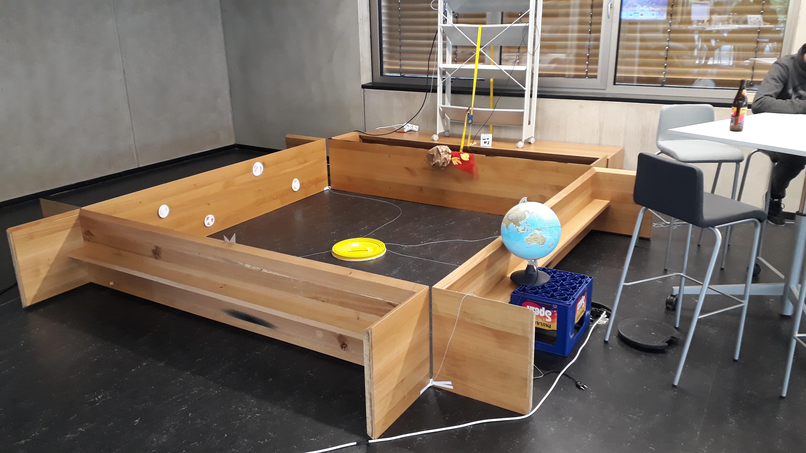

# ARUFO
4 player collaborative AR Game made at a one weekend hackathon at TUM. 
Video: https://www.youtube.com/watch?v=ZXIh2Yjff-g

# Gameplay
<a href="#">
<a href="#">
<a href="#">
  
# Setup
An iPad is put in a stationary position above the plane game field. The relative position and rotation was the iPad is measured. Biggest yellow contour is tracked using OpenCV, backprojected and intersection with plane of the game field is calculated to position the UFO.\
  
<a href="#">
  

